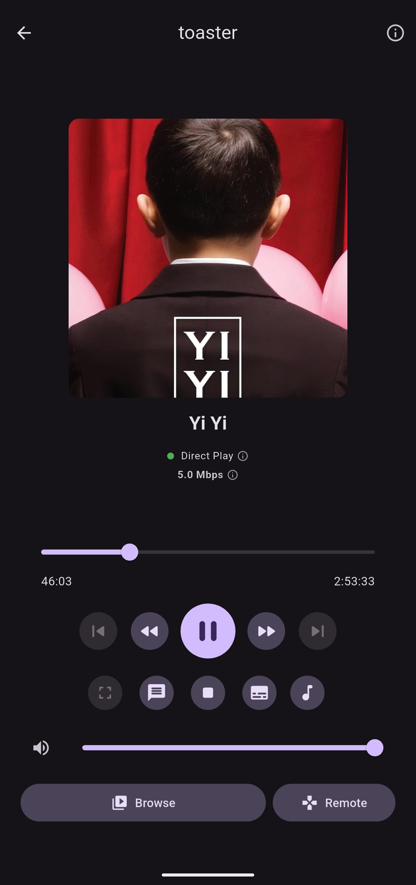
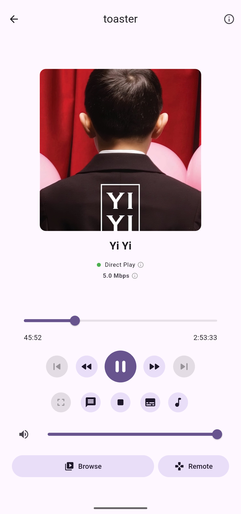
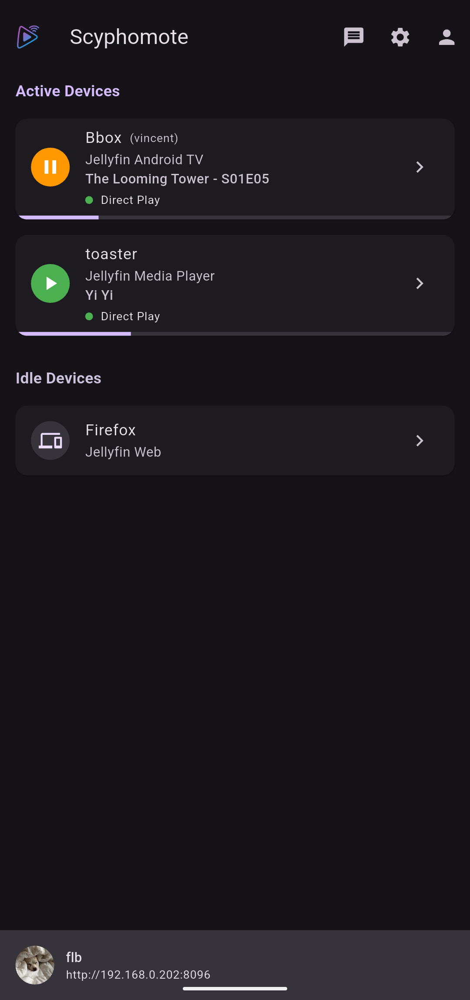
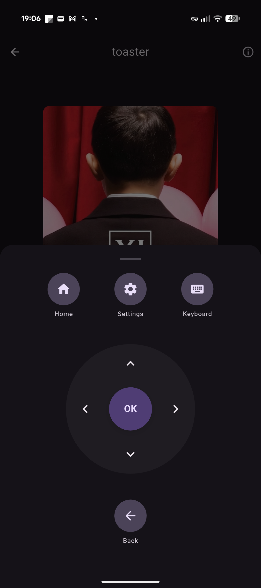
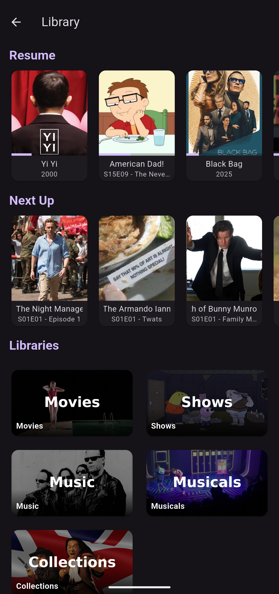

# Scyphomote

Scyphomote is a dedicated remote control for Jellyfin, built with Flutter.

## Features

* Multi-server and multi-user management.
* Session discovery and selection.
* **Media Library**: Browse and play movies, shows, and music directly from the app.
* **Resume Watching**: Resume playback on supported devices.
* Playback controls (play/pause, stop, seek, volume).
* **Advanced controls**: Fast forward, rewind, and track skipping.
* **Segment Skipping**: Skip intros, outros, and other segments.
* **Communication**: Send messages to active sessions.
* **Stream Selection**: Change audio tracks and subtitles on the fly.
* **Remote Navigation**: Full directional remote for controlling any Jellyfin client interface that supports it.
* **Now Playing**: Metadata, high-quality artwork, and synchronized **lyrics** for music.
* **Trickplay support**: Visual frame previews while seeking (supports Jellyfin's trickplay/bif files).
* **Cast & Crew**: View cast and crew members.
* **Playback transparency**: View playback method (Direct Play vs. Transcoding) with detailed transcode reasons and quality metrics.
* Detailed session information (capabilities, supported commands, media types).
* Material 3 interface with light/dark theme support.

## Screenshots

<div style="display: flex; overflow-x: auto; gap: 10px; padding-bottom: 10px;">
  
  
  
  
  
</div>

## Building

Requires Flutter SDK 3.10+.

```bash
# Get dependencies
flutter pub get

# Run on available device
flutter run
```

## License

This project is licensed under the [GNU AGPLv3](LICENSE).
